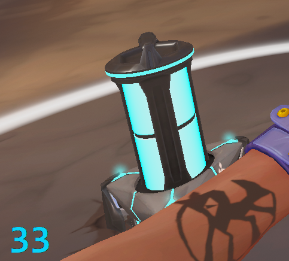

# ⏱️ ValTimer - Valorant Spike Timer

<div align="center">


**Automatic Spike detection and countdown timer overlay for Valorant**

[Download Latest Release](https://github.com/trtrantnt/ValTimerv1.2/releases) • [Report Bug](https://github.com/trtrantnt/ValTimerv1.2/issues) • [Request Feature](https://github.com/trtrantnt/ValTimerv1.2/issues)

</div>

---

## 📋 Table of Contents

- [About](#-about)
- [Features](#-features)
- [Screenshots](#-screenshots)
- [Installation](#-installation)
- [Usage](#-usage)
- [Building from Source](#-building-from-source)
- [Technologies](#-technologies)
- [FAQ](#-faq)
- [Contributing](#-contributing)
- [License](#-license)

---

## 🎯 About

**ValTimer** is an intelligent overlay application that automatically detects when the Spike is planted in Valorant and displays a precise 45-second countdown timer. Built with computer vision (OpenCV), it uses template matching to detect the Spike UI element on your screen.

Perfect for:
- 🎮 Competitive players who need precise timing
- 📊 Players learning Spike timings and rotations
- 🏆 Teams coordinating defuse/retake strategies

---

## ✨ Features

### 🌐 **Bilingual Support (NEW in v1.3.0)**
- **Vietnamese/English** - Full language switching
- **EN/VI Toggle Button** - Switch languages instantly
- All UI elements translated (buttons, labels, info panels, warnings)
- Seamless language switching without restart

### 🔍 **Automatic Detection**
- Real-time Spike plant detection using OpenCV template matching
- **Intelligent round-end detection** - automatically stops countdown when round ends
- No game modifications or memory reading required
- Works entirely through screen capture (safe & undetectable)

### ⏰ **Precise Countdown**
- 45-second countdown overlay appears automatically
- **Color-Coded Timer**:
  - 🟦 Cyan (45s-21s): Safe period
  - 🟨 Yellow (20s-11s): Warning
  - 🟧 Orange (10s-8s): Danger
  - 🟥 Red (<7s): Critical with decimal display
- **Live Position Updates** - Change overlay position while running (no restart)
- **4 Corner Positions** - Top-left, top-right, bottom-left, bottom-right
- **Auto-stop on round end** - detects when Spike icon disappears
- 50-second cooldown between detections to prevent false triggers

### 🖥️ **Multi-Resolution Support**
- **1920x1080** (Full HD) - All 4 corners
- **2560x1440** (2K/1440p) - All 4 corners
- **1440x1080** (4:3 stretched) - All 4 corners
- Optimized ROI (Region of Interest) for each resolution

### 🎨 **Modern UI**
- **Valorant-Themed Interface** with modern card-style design
- **Collapsible Info Panels** - Spike Info and About Me panels expand inline
- **Improved Button Layout** - 3 centered buttons with optimized sizing:
  - Spike Info (Blue): Spike mechanics and timings
  - About Me (Blue): App information
  - EN/VI (Green): Language switcher
- **System Tray Integration** - Minimize to tray
- **EXIT Button** - Quick exit from main window

### � **Information Panels**
- **Spike Info Panel**: Detailed Spike mechanics (plant, detonate, defuse timings)
- **About Panel**: App version, developer info, GitHub link
- **Mutual Exclusion**: Opening one panel closes the other
- **Windowed Fullscreen Warning**: Clear orange warning for game mode requirement

### ⚡ **Performance Optimization**
- **90% CPU reduction** during countdown (20 FPS → ~1.67 effective FPS)
- Adaptive scan rate: 20 FPS during detection, 5 FPS with frame skipping during countdown
- Smart resource management for long gaming sessions
- See [PERFORMANCE_OPTIMIZATION.md](PERFORMANCE_OPTIMIZATION.md) for details

---

## 📸 Screenshots

### Main Interface - English


### Main Interface - Vietnamese


---

## 📥 Installation

### Option 1: Download Executable (Recommended)

1. Go to [Releases](https://github.com/trtrantnt/ValTimerv1.2/releases)
2. Download the latest `ValTimer.exe`
3. Run the executable (no installation needed!)

### Option 2: Run from Source

```bash
# Clone the repository
git clone https://github.com/trtrantnt/ValTimerv1.2.git
cd ValTimerv1.2

# Install dependencies
pip install -r requirements.txt

# Run the application
python timer_valo.py
```

---

## 🚀 Usage

### Quick Start

1. **Launch ValTimer.exe**
2. **Select your resolution** (1920x1080, 2560x1440, or 1440x1080)
3. **Click "Start Detection"**
4. **Play Valorant!**
   - Timer will automatically appear when Spike is planted
   - Timer shows exact countdown from 45 seconds

### Controls

| Button | Description |
|--------|-------------|
| **1920x1080** | Select Full HD resolution |
| **2560x1440** | Select 2K/1440p resolution |
| **1440x1080** | Select 4:3 stretched resolution |
| **Top-Left/Right/Bottom-Left/Right** | Choose countdown overlay position |
| **Thông Tin Spike / Spike Info** | View Spike mechanics and timings |
| **Về Tác Giả / About Me** | View app information |
| **EN/VI** | Switch between English and Vietnamese |
| **❌ EXIT** | Exit application |
| **⏹ STOP TIMER** | Stop detection and hide timer |

### Language Switching

- Click the **🌐 EN/VI** button to toggle between Vietnamese and English
- All UI elements update instantly
- Language preference persists across sessions
- **Vietnamese**: Full translation including buttons, labels, and info panels
- **English**: Original English interface

### Countdown Position

- **Change position anytime** - even while timer is running!
- Choose from 4 corner positions for each resolution
- No need to restart detection
- Position updates immediately on screen

### System Tray

- **Minimize**: Click ❌ to minimize to system tray
- **Show Window**: Right-click tray icon → Show
- **Exit**: Right-click tray icon → Exit

### Finding ROI for Custom Resolution

If your resolution is not supported, use `find_spike_position.py` to find the correct ROI:

```bash
# 1. Run the ROI finder tool
python find_spike_position.py

# 2. Go to Valorant and plant the Spike
# 3. Alt+Tab back and press Enter to capture screen
# 4. Draw a rectangle around the Spike icon
# 5. Press 's' to save ROI coordinates

# 6. Copy the output to timer_valo.py RESOLUTION_SETTINGS
```

The tool will generate:
- ✅ ROI coordinates in Python format
- ✅ JSON file with ROI data
- ✅ Screenshot and ROI region image

---

## 🔨 Building from Source

### Prerequisites

- Python 3.13 or higher
- pip package manager

### Build Steps

```bash
# 1. Clone repository
git clone https://github.com/trtrantnt/ValTimerv1.2.git
cd ValTimerv1.2

# 2. Install dependencies
pip install -r requirements.txt

# 3. Build executable
python -m PyInstaller --onefile --windowed --name "ValTimer" timer_valo.py

# 4. Find executable in dist/ folder
cd dist
```

### Custom Icon (Optional)

```bash
# Generate custom icon
python app_icon.py

# See CUSTOM_ICON.md for detailed instructions
```

---

## 🛠️ Technologies

- **Python 3.13** - Core programming language
- **OpenCV (cv2)** - Computer vision and template matching
- **NumPy** - Numerical operations for image processing
- **MSS** - Fast screen capture
- **Tkinter** - GUI framework
- **Pillow (PIL)** - Image handling
- **pystray** - System tray integration
- **PyInstaller** - Executable packaging

### Detection Algorithm

1. **Screen Capture**: Captures ROI using MSS (ultra-fast)
2. **Edge Detection**: Applies Canny edge detection (thresholds: 100, 200)
3. **Template Matching**: Uses `TM_CCOEFF_NORMED` method
4. **Threshold**: Match confidence > 0.15 triggers countdown
5. **Round-End Detection**: Monitors Spike icon disappearance (10 consecutive frames < 0.05 threshold)
6. **Cooldown**: 50-second cooldown prevents duplicate detections

### Performance Features

- **Adaptive Scan Rate**: Automatically reduces from 20 FPS to 5 FPS during countdown
- **Frame Skipping**: Processes only 1 out of 3 frames during countdown (~1.67 effective FPS)
- **Smart Detection**: Stops countdown when round ends (Spike explodes/defused)
- **Resource Efficient**: 90% CPU usage reduction during active countdown

---

## ❓ FAQ

### **Q: Is this safe to use? Will I get banned?**

A: ValTimer only uses screen capture - it doesn't modify game files or read game memory. It's completely external and undetectable.

### **Q: Why isn't detection working?**

A: Make sure you've selected the correct resolution matching your Valorant display settings. Also ensure Valorant is in **Windowed Fullscreen** mode (not Fullscreen).

### **Q: Can I change the language?**

A: Yes! Click the **🌐 EN/VI** button to switch between Vietnamese and English. All text updates instantly.

### **Q: Can I move the countdown timer while it's running?**

A: Yes! Select any of the 4 corner positions and the timer will move immediately without restarting detection.

### **Q: What do the timer colors mean?**

A:
- **Cyan (45s-21s)**: Safe period - plenty of time
- **Yellow (20s-11s)**: Warning - consider your position
- **Orange (10s-8s)**: Danger - time to decide
- **Red (<7s)**: Critical - shows decimals for precise timing

### **Q: Can I use this on other resolutions?**

A: Currently only 1080p, 1440p, and 4:3 (1440x1080) are supported. Submit an issue to request your resolution!

### **Q: Does this work with Vanguard anti-cheat?**

A: Yes! ValTimer runs completely outside the game and doesn't interact with Valorant's process.

### **Q: The timer appears at wrong times**

A: Try adjusting detection threshold or ensure proper resolution is selected. Debug mode can help visualize ROI.

### **Q: How do I enable debug mode?**

A: Open `timer_valo.py`, change `DEBUG_MODE = False` to `DEBUG_MODE = True`, and rebuild.

### **Q: Does the timer stop when the round ends?**

A: Yes! The timer automatically detects when the Spike icon disappears (round ends) and stops the countdown immediately.

### **Q: Will this slow down my game?**

A: No! ValTimer uses adaptive scan rate and frame skipping to minimize CPU usage (only ~1.67 FPS during countdown), ensuring zero impact on game performance.

### **Q: What's the difference between the Info and About panels?**

A: **Spike Info** shows game mechanics (plant/defuse timings), while **About Me** shows app information (version, developer, GitHub).

---

## 🤝 Contributing

Contributions are welcome! Here's how you can help:

1. 🐛 **Report Bugs**: [Submit an issue](https://github.com/trtrantnt/ValTimerv1.2/issues)
2. 💡 **Request Features**: [Open a feature request](https://github.com/trtrantnt/ValTimerv1.2/issues)
3. 🔧 **Submit Pull Requests**:
   ```bash
   # Fork the repo
   # Create your feature branch
   git checkout -b feature/AmazingFeature
   
   # Commit your changes
   git commit -m 'Add some AmazingFeature'
   
   # Push to the branch
   git push origin feature/AmazingFeature
   
   # Open a Pull Request
   ```

---

## 📄 License

This project is licensed under the MIT License - see the [LICENSE](LICENSE) file for details.

---

## 🙏 Acknowledgments

- Riot Games for creating Valorant
- OpenCV community for computer vision tools
- All contributors and users of ValTimer

---

<div align="center">

**⭐ If you find this project useful, please consider giving it a star!**

[⬆ Back to Top](#️-valtimer---valorant-spike-timer)

</div>
